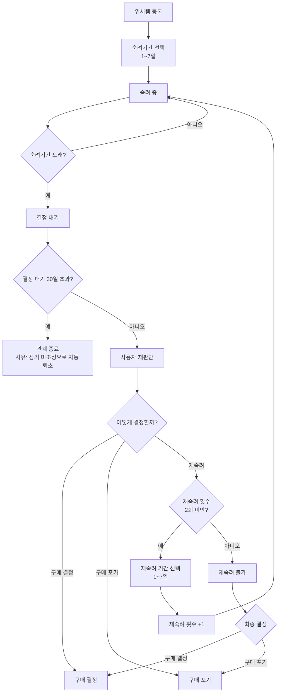

# 프로젝트: 욕망템 숙려캠프

개인용 웹앱. 로그인 없이 브라우저 localStorage에 데이터 저장.
충동구매 방지를 위해 사고 싶은 물건을 바로 안 사고 1~7일 "숙려 기간"을 거쳐 결정하는 서비스.

## UI 워딩 (캠프 메타포)
코드 식별자(`decided`, `abandoned`, `reDeliberateItem`, `dbtn--redo` 등)는 그대로 두고, **화면에 보이는 문구만** 아래 용어를 쓴다.

| 개념 | UI 문구 |
|---|---|
| 위시템 등록 / 등록일 | 입소 / 입소일 |
| 사고 싶은 이유 | 입소 사유 |
| 재숙려 | 유예 |
| 구매 결정(`decided`) | 구매 승인 |
| 구매 포기(`abandoned`) | 관계 종료 |
| 결정 메뉴 / 탭 | 조정실 |
| 통계 화면 | 캠프 기록 |

- "숙려"(deliberation)는 그대로 유지. `STATUS_LABEL`(`src/lib/wishItems.ts`)이 승인/종료 문구의 단일 출처.
- 일부 일반명사로서의 "결정"(결정 이유, 지금 결정하기 등)은 유지 중.

## 기술 스택 / 실행
- Vite + React 18 + TypeScript, 라우팅은 react-router-dom
- `npm run dev` 개발 서버(5173), `npm run build` 타입체크 + 프로덕션 빌드
- 상태는 `localStorage` 한 곳에만 저장. `src/lib/storage.ts`가 로드/저장, 최초 실행 시 `src/lib/dummyData.ts`로 시드
- 목록 상태는 `src/lib/store.ts`의 모듈 스토어(`useSyncExternalStore`). `useWishItems()` 훅 + `addItem`/`updateItem`/`removeItem`/`resolveItem`/`reDeliberateItem`
- 스토어 로드 시 결정 대기 30일 초과 항목을 자동 퇴소(관계 종료, 사유 "장기 미조정으로 자동 퇴소되었습니다.")로 스윕(`sweepAutoAbandon`)
- 도메인 로직(숙려 종료일, 결정 대기 여부, 재숙려 가능 여부, 카운트 등)은 `src/lib/wishItems.ts`. 숙려 종료는 `deliberationStartedAt ?? createdAt` + `deliberationDays` 기준(재숙려 시 `deliberationStartedAt` 갱신)
- 데이터 모델은 `src/types.ts`의 `WishItem`

## 화면 구조
- `src/App.tsx` 공통 레이아웃(헤더 + Outlet + 하단 탭바). 탭: 홈 `/` / 조정실 `/decision`(대기 건수 배지) / 캠프 기록 `/stats` / 입소 `/register`
- `src/pages/Home.tsx` 홈(요약 카드 3개 + 결정 대기 배너 + 숙려 중 리스트)
- `src/pages/Register.tsx` 위시템 등록 폼 → 제출 시 `addItem` 후 홈으로 이동
- `src/pages/Decision.tsx` 결정 대기 목록. 카드별 구매 결정 / 재숙려(1~7일, 최대 2회) / 구매 포기, 결정 이유 입력
- `src/pages/ItemDetail.tsx` `/item/:id` 상세(상품/등록/숙려 정보) + 인라인 수정(`updateItem`) / 삭제(`removeItem`, confirm)
- `src/pages/Stats.tsx` 통계(구매 포기율 + 아낀 금액, 금액 통계 스택바, 평균 숙려일, 카테고리별 막대). 계산은 `src/lib/stats.ts`
- `src/components/WishItemForm.tsx` 등록·수정 공용 폼(검증, 가격 콤마, URL 정규화). 홈 카드 전체가 `/item/:id` 링크(오버레이 방식)

## 핵심 흐름
- 등록: 상품링크, 상품명, 가격, 카테고리, 사고 싶은 이유, 숙려기간(1~7일) 입력
- 홈: 숙려 중/구매결정/구매포기 건수 현황, 숙려 중인 리스트, 위시템 상세(상품정보/등록정보/숙려정보)
- 결정: 숙려기간 도래한 항목 재판단 → 구매결정/재숙려/구매포기 + 결정 이유 작성
- 통계: 금액 통계(총 위시금액/구매결정금액/구매포기금액), 카테고리별 통계, 평균 숙려일

## 정보구조 (IA)

## User flow

